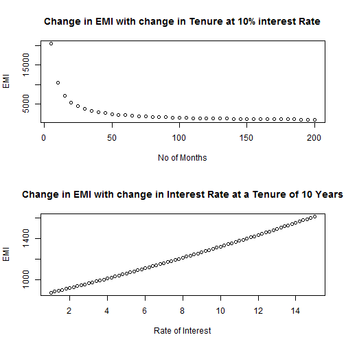

EMI Calculatior
========================================================
author: Lakme 
date: Sun Feb 22 06:53:23 2015
transition: zoom

Key features of a Loan from a bank
========================================================
font-family:'Helvetica'

Any Loan provided by a Bank or any financial Institution will have the following features
- Tenure of the Loan
- Rate of Interest
- Repayment Schedule

Equated Monthly Installments commonly known as EMIs is one of the common  repayment schemes offered by the banks for Retail Customers.Under EMI scheme the 
customer who avails the Loan will have to pay equal amounts every month through out the tenure of the Loan.

Choosing the right Loan
========================================================

- Assuming that the required amount of loan for  a perticular customer remains constant, the EMI amount varies depending on the tenure and interest rate.
- Banks typically offer loans with different interest rates for different tenures and Amounts.
- So the customers can evaluate different combinations of available loan schems
to arrive at the ideal features of loan as per their financial requirements

EMI variability with changes in Tenure and Interest rate
========================================================

 

***
<small>
- Plots have been done for a Loan Amount of 100,000$
- This demonstrates the variability of EMI with change in the features of the Loan
</small>
Why EMI Calculator
========================================================

- It is important to know and decide which combination of Loan features works best for you 
-  Knowledge is Power, Hence Better knowledge will allow you to Bargain better with the Banker
- The EMI Calculator helps in comparing different combinations of these Loans with one click of a button
- You can Try the App at https://lakme.shinyapps.io/APPNAME/
- Next time when you plan to avail a Loan don't forget to visit the App before you visit your Bank!
